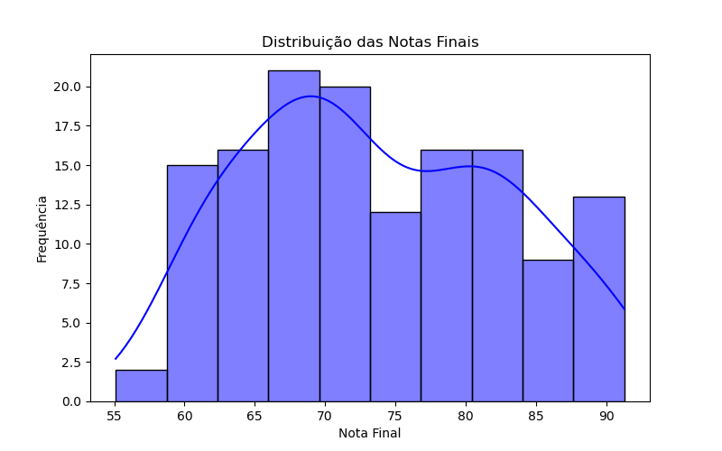
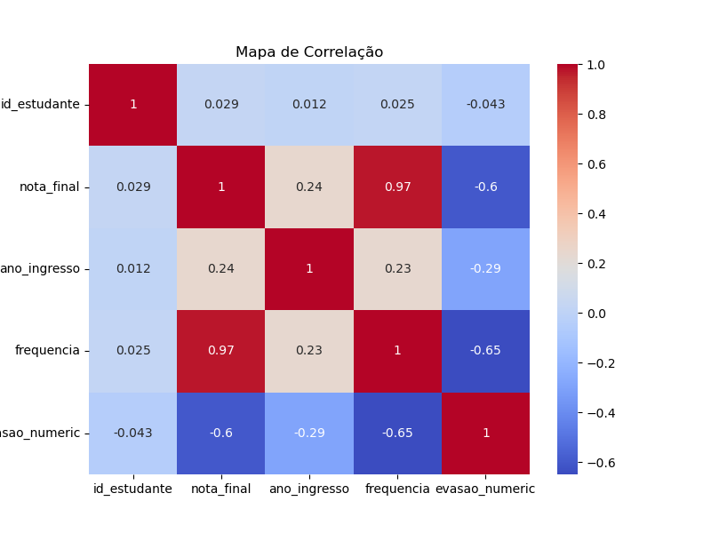
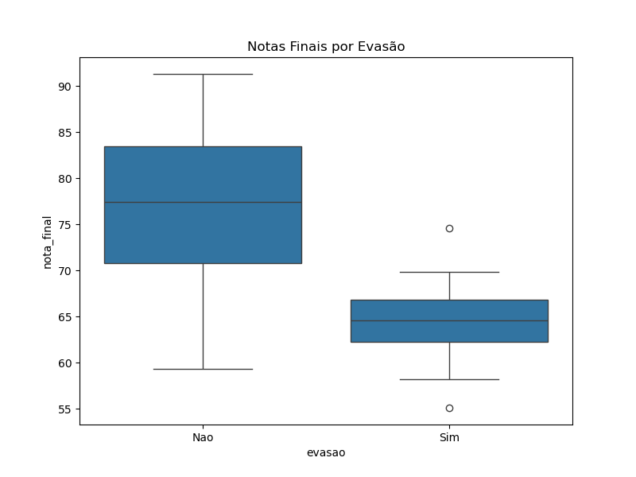
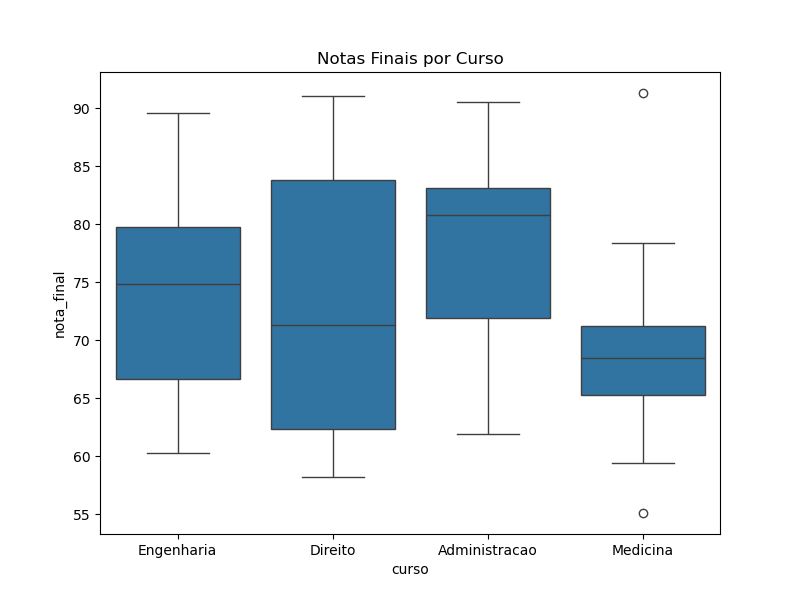

# 📊 Análise Descritiva do Desempenho Acadêmico

Este projeto tem como objetivo realizar uma **análise descritiva** dos dados de desempenho de estudantes, explorando métricas como notas finais, evasão e diferenças entre cursos.  
A análise foi feita em **Python**, utilizando bibliotecas voltadas para **ciência de dados e visualização**.

---

## 🧠 Objetivo
Compreender o comportamento dos estudantes a partir de um conjunto de dados, identificando padrões, relações entre variáveis e possíveis fatores associados à evasão acadêmica.

---

## 🧰 Tecnologias Utilizadas
- **Python**
- **Jupyter Notebook**
- **Pandas**
- **Seaborn**
- **Matplotlib**

---

## 📈 Etapas da Análise

### 🔹 Estatísticas Descritivas
Foram calculadas medidas de tendência central e dispersão (média, mediana, desvio padrão) para compreender o comportamento geral das variáveis.

### 🔹 Distribuição das Notas Finais
O histograma evidencia a variação das notas, com maior concentração entre **65 e 80 pontos**, sugerindo um desempenho moderado da maioria dos estudantes.

  

### 🔹 Mapa de Correlação
O **heatmap** foi utilizado para visualizar a correlação entre variáveis numéricas. Essa etapa ajuda a identificar possíveis relações entre a nota final, evasão e outros fatores.

  

### 🔹 Boxplot – Notas Finais por Evasão
O boxplot permite observar as diferenças de notas entre estudantes que **evadiram** e **não evadiram**, revelando um padrão de menor desempenho entre os evadidos.

  

### 🔹 Boxplot – Notas Finais por Curso
Aqui são comparadas as notas médias entre diferentes cursos, mostrando a **distribuição do desempenho por área**.

  

---

## 📊 Conclusões
A análise demonstrou que:
- A maior parte dos alunos apresenta notas entre 65 e 80;
- Há **correlações leves** entre nota final e evasão;
- Cursos específicos podem apresentar **variações significativas no desempenho médio**;
- A visualização dos dados auxilia na identificação de padrões que podem embasar **estratégias de melhoria educacional**.

